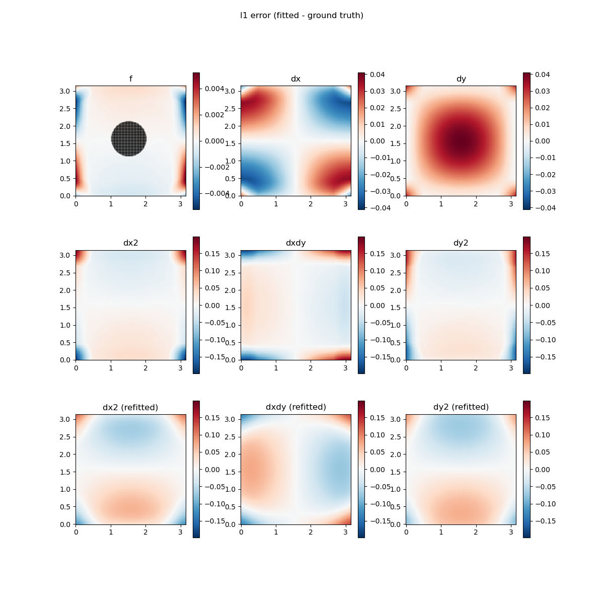

<p align="center">

</p>

Development repository for an AI-based reducer-order modeling (ROM) accelerator for partial differential equations (PDEs) in 2D.

*As of late 2023, this repository documents a work in progress, of which some components are ready, while others are being developed.*


<!-- markdown-toc start - Don't edit this section. Run M-x markdown-toc-refresh-toc -->
**Table of Contents**

- [Introduction](#introduction)
- [System overview](#system-overview)
    - [CVAE example: MNIST digits](#cvae-example-mnist-digits)
- [The weighted least-squares meshfree method (WLSQM)](#the-weighted-least-squares-meshfree-method-wlsqm)
    - [The method](#the-method)
    - [Continuity and accuracy](#continuity-and-accuracy)
    - [Numerical results](#numerical-results)
    - [Implementation notes](#implementation-notes)
    - [Conclusion](#conclusion)
- [Dependencies](#dependencies)
- [Install & uninstall](#install--uninstall)
    - [From source](#from-source)
- [GPU acceleration](#gpu-acceleration)
    - [Setup](#setup)
    - [Use](#use)
- [License](#license)
- [Etymology](#etymology)
- [Thanks](#thanks)
- [References](#references)
- [Further reading](#further-reading)

<!-- markdown-toc end -->


## Introduction

In the engineering sciences community, *digital twins* (DT) have been attracting research attention in the recent years. As of late 2023, one popular definition of the concept is as follows:

*A digital twin is defined as a virtual representation of a physical asset enabled through data and simulators for real-time prediction, monitoring, control and optimization of the asset for improved decision making throughout the life cycle of the asset and beyond.* (Rasheed et al., 2020)

Digital twins can be divided into different capability levels (Stadtman et al., 2023):

 1. **Standalone**. *Standalone description of the asset disconnected from the real environment. The physical asset may not yet exist.*
 2. **Descriptive**. *CAD-models and real-time stream of sensor data describe the up to date state of the asset at any point in time.*
 3. **Diagnostic**. *Can present diagnostic information which supports users with condition monitoring and troubleshooting.*
 4. **Predictive**. *Can predict the system's future states of performance and can support prognostic capabilities.*
 5. **Prescriptive**. *Can provide prescription or recommendations based on what if / risk analysis and uncertainty quantification.*
 6. **Autonomous**. *Can replace the user by closing the control loop to make decisions and execute control actions on the system autonomously.*

This code repository is concerned with building a simple *predictive* digital twin, which requires numerical simulation at realtime speeds and beyond.

Classical numerical methods for partial differential equations (PDEs), even if GPU-accelerated, are typically far too slow for this, especially in problems involving nonlinear models and multiphysics. Hence, in the last decade, *reduced-order modeling* (ROM) has received much research interest. The basic idea of ROM is to reduce the size of the model, by wisely picking a small number of degrees of freedom. Classical ROM techniques for PDEs include [POD](https://en.wikipedia.org/wiki/Proper_orthogonal_decomposition) and [PGD](https://en.wikipedia.org/wiki/Proper_generalized_decomposition), both of which construct a reduced Galerkin basis to represent solutions. A more recent arrival are techniques based on artificial intelligence (AI), specifically on [*deep learning*](https://www.deeplearningbook.org/).

Reduced-order modeling does not replace classical numerical simulation, but rather augments it. A ROM can only reproduce behavior it has seen in during its training. Thus, when applying a ROM, the preparation of a representative dataset is extremely important.

The value of ROM lies in its ability to greatly accelerate *online* (system use time) computations, at the cost of a computationally expensive *offline* (system deployment/installation time) preparation process. It is thus ideal as an accelerator of online computation for digital twins.

This repository stores prototype code, and documents ongoing theoretical and computational research into tools with digital twin applications at [JAMK University of Applied Sciences](https://www.jamk.fi/en).


## System overview

**NOTE**: *This section describes the finished system. Details are subject to change as development proceeds.*

The desired time-dependent partial differential equations are first solved using FEniCS (see e.g. [`extrafeathers`](https://github.com/Technologicat/extrafeathers)). This produces a series of snapshot FEM solutions, of numerically simulated instantaneous states of the physical system being modeled. These solutions are exported from the solver in both FEniCS and VTK formats.

The individual solution snapshots, from different instants of simulated time, are then rendered into bitmap images. These bitmap images form the training dataset for an AI-based accelerator. The aim of the AI accelerator is to quickly generate solutions in the part of the solution space that is spanned by the training data. Training the accelerator produces a reduced-order model (ROM).

We use a cartesian pixel grid format to represent the raw solution snapshots, in order to easily apply image processing AI techniques. The FEM mesh is not seen by the AI, so arbitrary meshes can be used. In fact, arbitrary numerical methods can be used, too; FEM is just a convenient choice for which good open-source software frameworks exist (such as [`FEniCS`](https://fenicsproject.org/) or [`Firedrake`](https://www.firedrakeproject.org/) for Python, or [`Gridap.jl`](https://github.com/gridap/Gridap.jl) for Julia; all three accept weak forms of PDEs as input). To the AI, any 2D tensors (with sufficiently high bit depth, preferably in a float format) representing numerical solutions are acceptable input.

In principle, measured data from physical experiments could also be used as input, but then denoising becomes an important consideration. Therefore, at least at this stage, we limit the scope of the AI system to only handle numerical simulations as its input.

Compared to classical dimension reduction, the dimension reduction of a PDE solution to produce a ROM is a different problem. Classical methods - such as [t-SNE](https://opentsne.readthedocs.io/en/stable/), *uniform manifold approximation and projection* ([UMAP](https://umap-learn.readthedocs.io/en/latest/)), *spectral embedding* (SE; a.k.a. *laplacian eigenmaps*, or *diffusion maps*), *multidimensional scaling* (MDS), or ISOMAP - solve the problem of reducing a handful of dimensions (at most a few dozen) into two or three dimensions. Important use cases of these techniques are data visualization and anomaly detection (anomalous data points often map outside the manifold in the low-dimensional embedding).

A PDE solution field, on the other hand, has a very large number of degrees of freedom, many of which are highly correlated. Rather than using classical techniques to directly reduce the Galerkin coefficient data from FEM, or a bitmap image of the solution, it is more appropriate to first apply a *representation learning* AI technique to compress this very high-dimensional data into a handful of dimensions, each of which represents an independent explaining factor (at least locally).

For general data compression, classical compressors (such as `gzip`) are in practice better than AI techniques. While for example a large language model (LLM) [can be used as a generic data compressor](https://techxplore.com/news/2023-10-ai-png-flac-compression.html) ([study](https://arxiv.org/abs/2309.10668)), and its compression ratio may win over classical techniques, the total size including the compressor utility is much larger as it includes the multi-gigabyte LLM, and also computationally it is much more expensive.

The value of representation learning lies, rather than in the compression capability itself, in the *understanding* (for lack of a better word) that underlies the compression capability. The compressed representation is not just shorter (in data length) than the input data, but it *says something about the data*. In representation learning, *to compress is to understand*. Such a *meaningfully structured representation* is obviously applicable as a reduced-order model.

Another important application of representation learning is as a tool for AI-assisted research. Instead of a human researcher manually grouping data examples and figuring out which features can be used to best explain variation in the dataset, representation learning automates the tedious part of this process. The AI training process automatically groups the data examples and suggests possible features, so that the human researcher can concentrate on interpreting them. This makes it possible to scale up to larger dataset sizes, to find features that might be missed in a manual analysis, and to obtain results faster.

As is popular in AI nowadays, we use a latent-space approach, specifically, a *convolutional variational autoencoder* (CVAE). We implement the CVAE as a Keras `Model`, which itself conforms to the Keras model API, but also exposes its encoder and decoder submodels as separate `Model` instances so that the trained model can be used as a latent-space lossy compressor for data similar enough to the training data.

<p align="center">
 <br/>
<i>The VAE is a bayesian probabilistic AI model trained via a variational method. For details, see Kingma and Welling (2019), and <a href="doc/vae.pdf">the docs</a>.</i>
</p>

Training the CVAE produces a low-dimensional generative model for synthetic data similar to the training data. The CVAE learns to compress the bitmap images into a *latent representation* (a.k.a. the *code*), which encodes a small number of features that are relevant for the PDE and dataset in question. The latent representation is our reduced-order model (ROM).

To make an AI model with practical value for the present use case, we customize the basic CVAE with several ideas from literature, for example *ResNet blocks* (He et al., 2015a), the PReLU (parametric rectified linear unit) activation (He et al., 2015b), *instance normalization* (Wu and He, 2018), *channel dropout* training (Tompson et al., 2015), the *skip-VAE* (Dieng et al., 2019), and the *consistently regularized VAE* (Sinha and Dieng, 2022).

Note that even the classical autoencoder produces a code that is, strictly speaking, continuous in the ε-δ sense, and likely also Lipschitz-continuous. However, the Lipschitz constant can be so large as to make the continuity useless in practice. Some "nearby" inputs (in some norm appropriate for the input data) may still map very far from each other in the code space. An important property of the VAE is that it reduces the sensitivity of the code to *arbitrary* small perturbations in the input, so that *all* nearby inputs in the training data are mapped near each other in the latent space. This makes the latent space of a VAE useful as a continuous, low-dimensional representation of the data.

We regularize the latent space layout in two ways. First, by using a variational autoencoder (VAE) instead of a classical autoencoder, spaghetti layouts are avoided via the regularizing effect of the *latent prior* term in the ELBO loss function. Secondly, we apply the *consistently regularized VAE* idea to the training process. By augmenting each snapshot with auxiliary, *physically* nearby ones (a small timestep `Δt` apart in the numerical simulation data), we ensure that states that are physically near each other, also map near each other in the latent space. This prioritizes *physical similarity*, instead of just minimizing sensitivity to *arbitrary* perturbations. (This idea is a distant relative of preserving distance or topology, as seen in some of the classical dimension reduction methods already mentioned, namely ISOMAP, MDS, or UMAP.)

We improve the quality of the latent representation *specifically for PDE applications* by using the fundamental insight behind the *physics-informed neural network* (PINN; Raissi et al., 2018). When creating a specialized AI for a particular scientific task, it is advantageous to include *a priori* scientific knowledge about the problem context into the AI training process.

Instead of training a purely statistical model, we train a *physically informed* statistical model, which respects the constraints we explicitly included in the training, without needing to statistically detect these constraints from the training data. This typically increases the accuracy of the statistical model, as well as reduces the amount of training data needed.

However, unlike in the original PINN, we do not redesign the whole neural network to accommodate the PDE, but instead we train a generic CVAE that autoencodes bitmap images. However, we tune the loss function so that the generative model *favors images that represent solutions of the desired PDE*, i.e., images that minimize the squared residual of the PDE, estimated from the bitmap image. In practice, we add a squared-residual penalty term (with some suitable global penalty coefficient) to the ELBO loss. This specializes the CVAE to autoencode solutions of the PDE.

For example, consider fluid mechanics. The balance law of linear momentum is *a priori* knowledge. We know that no matter the specific case, the physical system (and therefore the numerical solution snapshots that represent it) must satisfy this balance law. For the Navier-Stokes equations, by minimizing the mean squared residual of the velocity equation, we enforce momentum conservation in the synthetic data produced by the generative AI model.

To evaluate the PDE residual from a bitmap image in a maximally non-intrusive way (in order to accommodate arbitrary PDE solvers), we use the *weighted least-squares meshfree* (WLSQM) method. This method fits a local surrogate model to the image data, separately for each pixel, in a small neighborhood of the pixel. Parallelization with GPU acceleration makes the computation reasonably fast.

Finally, we train another neural network to act as a time evolution operator on the latent space. The online part of this computation is very fast, because it operates on the reduced-order model. To train the time evolution operator, we use the fact that the training data comes from a numerical simulation, which governs how the time-dependent state changes. Given an input state and a timestep size `Δt`, we can read off the correct final state from our training data. The objective of the time-evolution neural network then is to learn this mapping - in the latent space (which we regularized, precisely to be able perform this task easily).

In summary, once the AI components have been trained for the target PDE, the online part of the accelerated solution process is:

 1. Encode initial state (bitmap image) into the low-dimensional latent space.
 2. Run time evolution in the latent space.
 3. Along the latent-space trajectory, decode state snapshots into bitmap images.

See the schematic illustration below.

<p align="center">
 <br/>
<i>Schematic illustration of the full system. The encoder of the CVAE maps a solution field into a code point <b>z</b> in latent space. The time evolution operator integrates it for a timestep Δt. Finally, the decoder of the CVAE generates the corresponding solution field.</i>
</p>


### CVAE example: MNIST digits

Below are some results from applying the CVAE generically (without a physics-based loss) to the *MNIST digits* dataset. The AI was trained using [`demo.main`](demo/main.py), and the plots were produced by [`demo.test_script`](demo/test_script.py). For settings, see [`demo.config`](demo/config.py).

All of the "handwritten" digits shown in the plots are AI-generated, produced by the trained generative model (the CVAE decoder).

<p align="center">


<br/>
<i>Final trained state of three example runs of the CVAE on the MNIST digits dataset. Since the initialization of the model is random, and the model is stochastic, each run produces a different result. Generic CVAE, no physics-based loss. 2D latent space. Note the quantile-based scale on the axes, accounting for the spherical gaussian latent prior. The box is [-3σ, 3σ]²; we use the standard prior with μ = 0, σ = 1.</i>
</p>

The latent coordinates correspond to explaining factors, at least locally. For example in the rightmost run, for the digits 1, 4, and 6, the horizontal (z₁) coordinate corresponds to the angle (tilt) of the handwritten digit. Note that code points in unused parts of the latent space (regions devoid of training examples), may decode into nonsense.</i>

The splashes of color denote the latent space coordinates obtained by encoding the training examples (all 60000 of them). Via the training process, different examples of the same variant of the same digit are pulled together in the latent space (similarly to how a human might classify them). Different variants and different digits become separated.

Unlike many tutorials and early studies of VAEs, we use a [continuous Bernoulli](https://en.wikipedia.org/wiki/Continuous_Bernoulli_distribution) observation model (Loaiza-Ganem and Cunningham, 2019) to properly represent grayscale data. This is a simple modification that yields a major improvement in quality. Each pixel is modeled as a continuous probability distribution of brightness values in the interval [0, 1]. Contrast the classical discrete Bernoulli observation model, where each pixel is modeled as a discrete probability distribution for being either completely white or completely black. This leads to a need to binarize the input data, which unnecessarily hurts quality. Using the continuous Bernoulli observation model avoids the binarization.

Also, the mean of the observation distribution is often used as the decoded output; we too follow this choice. The mean is a grayscale image. In the continuous Bernoulli model, a grayscale image is in the codomain of the observation model, whereas in the discrete Bernoulli model, it is not. If the output is to be a valid observation, i.e. one that can be expressed by the observation model, then the standard way of producing the decoded output requires the observation model to be continuous-valued.

Compared to the classical discrete Bernoulli VAE, the continuous Bernoulli observation model has the effect that the ELBO values become positive, and much higher. In each of the example runs shown, the final ELBO value is +1362. This is fine, because we are now dealing with *continuous* data. The observation distribution *pθ*(**x**|**z**) represents the *probability density* that, given a code point **z**, we get the bitmap image with pixel brightnesses **x**. This is before any discretization into an actual `uint8` color channel, so the brightness of each pixel is a *continuous* random variable in [0, 1]. Therefore, the pointwise probability density *pθ*(**x**|**z**) is allowed to have any nonnegative value (no matter how large), as long as for every fixed **z**, the probability mass of *all possible observations* for that **z** integrates to unity, i.e. ∫ *pθ*(**x**|**z**) d**x** = 1.

Recall that the ELBO is essentially a log-probability. The large ELBO value suggests that, at least as measured by a roundtrip of the training data through the CVAE, the *pθ*(**x**|**z**) distributions are almost Dirac deltas. In other words, given a code point **z**, and asking for the distribution of possible decoded (observed) outputs, the result is that the code point (informally speaking) almost certainly maps to the input **x** that produced that code point. This in turn suggests that the latent representation (together with the CVAE decoder) captures the training data well.

Although in this example we have a labeled dataset, the CVAE has no access to the labels. As a self-supervised learning algorithm, it does not need them. The labels are used purely for visualization of the results.

The model separates the digits 0, 1, 2, and 6 especially well. The challenging inputs are the digit groups (3, 5, 8) and (4, 7, 9), especially the variant of "7" with the bar (middle right in the second image). Another particularly challenging example for a 2D latent space is the "closed" variant of "4"; there is just a hint of it near the center of the second image.

Increasing the dimension of the latent space (not shown here) improves the capture of the challenging digits and variants, but then the latent space becomes impossible to visualize. At least up to 7 dimensions, each dimension increases the ELBO obtained at the end of the training. At 20 dimensions, the results are already very good. The final ELBO values from this test are tabulated below.

<table>
  <tr>
    <td><b>#dim</b></td>
    <td><b>ELBO</b></td>
  </tr>
  <tr>
    <td>2</td>
    <td>1362</td>
  </tr>
  <tr>
    <td>3</td>
    <td>1403</td>
  </tr>
  <tr>
    <td>4</td>
    <td>1433</td>
  </tr>
  <tr>
    <td>5</td>
    <td>1452</td>
  </tr>
  <tr>
    <td>6</td>
    <td>1471</td>
  </tr>
  <tr>
    <td>7</td>
    <td>1483</td>
  </tr>
  <tr>
    <td>...</td>
    <td></td>
  </tr>
  <tr>
    <td>20</td>
    <td>1525</td>
  </tr>
</table>

Using classical dimension reduction techniques, we can visualize the test dataset (in MNIST digits, 10000 examples) in the latent space, by nonlinearly projecting the data manifold into 2D. See the plot below.

<p align="center">
 <br/>
<i>Test examples (10000) in 20D latent space, nonlinearly projected into 2D using classical dimension reduction techniques.</i>
</p>

We see that out of the five methods tested, *uniform manifold approximation and projection* (UMAP) produces the clearest visualization, showing the presence of ten distinct clusters. The *t-distributed stochastic neighbor embedding* (t-SNE) reveals structure acceptably, but looks noisier than UMAP.

In *spectral embedding* (SE), when we project to 2D, the algorithm uses the two leading eigenvectors. It is apparent from the plot that this is not enough to clearly separate the clusters in this data. This in turn tells us that when using a 20D latent space, the data manifold in the latent space has more than two dimensions; or in other words, the variation in the dataset cannot be explained by just two factors (at least as discovered by this type of AI).

*Multidimensional scaling* (MDS), which attempts to preserve distance in the ambient 20D space, cannot discern any structure in the data; and ISOMAP, which attempts to preserve distance along the data manifold, does no better than the 2D spectral embedding.

From the UMAP plot, we see that the different digits separate well in the 20D latent space. Keep in mind that UMAP is designed to preserve local topology. In the UMAP plot, intra-cluster distances indicate similarity between examples, whereas inter-cluster distances are completely meaningless.

Also in the UMAP plot, we see that a small number of test examples, especially of the digit "8", incorrectly map into the cluster for "3". Be aware that all of the data points shown in this figure are from the *test dataset*, so the CVAE never saw them during its training - so in general, we should expect some of them to cluster incorrectly.

Thinking further on the failure of the spectral embedding, a dimensionality consideration also suggests why the ELBO increases as we increase the dimension of the latent space and re-train the AI. The CVAE is also performing dimension reduction, from the very high-dimensional raw data into the latent space. If the dimensionality of the latent space is too low, the CVAE has no choice but to embed the (unknown, to be discovered) data manifold into a space with dimensionality lower than that of the manifold itself, which inevitably forcibly crushes the manifold in the process. How well such an embedding can succeed even in principle, obviously depends on the topology of the manifold. But if the latent space is slightly higher-dimensional than the manifold (so as to be able to represent its curvature in the euclidean ambient space), then a faithful representation can be obtained without such embedding.

Returning to the problem of 2D visualization via nonlinear projection of the latent space data manifold, [map projection](https://en.wikipedia.org/wiki/Map_projection) is an analogous problem, but this is more extreme: here we attempt to represent an arbitrary, high-dimensional hypersurface, in the general case having nonzero curvature, in two-dimensional euclidean space. (For an n-dimensional generalization of the [Gauss curvature](https://en.wikipedia.org/wiki/Gaussian_curvature), see Gladkov, 2020.)

In conclusion, UMAP allows us to visualize clusters rather well. The next question is, how else can we visualize the data when using a high-dimensional latent space?

One approach is to visualize AI-generated examples. One could sample code points from the aggregated latent posterior *pθ*(**z**), which is the final distribution of code points of the trained CVAE. Feeding those to the generative model (the CVAE decoder) produces new examples from the captured distribution.

However, Lin et al. (2019) observe that the actual *pθ*(**z**), as obtained by an ancestral sampling of *pθ*(**x**|**z**) over the training data examples **x** (see Takahashi et al, 2019), is too concentrated on the code points of the training examples to be of much use for drawing samples from the generative model that look distinct from the training examples. Lin et al. suggest first smoothing the distribution by establishing a small gaussian mixture approximation of *pθ*(**z**) via expectation maximization (EM), or alternatively, bayesian inference methods, and then sampling from that. We have not implemented this yet.

To evaluate the statistical performance of the CVAE, we provide some functions in [`randomthought.perfstats`](randomthought/perfstats.py). Currently, we can measure *active units* (AU), i.e. the number of latent dimensions actually in use, as estimated from the covariance between **x** and **z** (Burda et al., 2015); the mean *negative log-likelihood* (NLL) of the data under the trained model (a close relative of the ELBO; see e.g. Sinha and Dieng, 2022); the *Kullback-Leibler divergence* (KL) of the variational posterior from the latent prior (i.e. the KL regularization term of the ELBO), and the *mutual information* (MI) between **x** and **z**, as induced by the variational joint (definitions vary slightly; see e.g. Sinha and Dieng, 2022, or Dieng et al., 2019). This part of the library is not complete yet.

For the CVAE with a 20D latent space (final ELBO 1525), the measurement results, using all 10000 examples in the *test dataset*, are:

<table>
  <tr>
    <td align="right"><b>AU</b></td>
    <td>20</td>
  </tr>
  <tr>
    <td align="right"><b>NLL</b></td>
    <td>-1530.6</td>
  </tr>
  <tr>
    <td align="right"><b>KL</b></td>
    <td>37.696; 37.695; 37.696</td>
  </tr>
  <tr>
    <td align="right"><b>MI</b></td>
    <td>9.696; 9.288; 9.698</td>
  </tr>
</table>

The KL and MI measurements were repeated three times, with 1000 MC samples of <b>z</b> for each repetition. Especially the MI value is sensitive to the randomness in the MC sampling.

Other possible ways to visualize the result include latent interpolation between two given training data examples, and a sampling (e.g. a [latin hypercube](https://en.wikipedia.org/wiki/Latin_hypercube_sampling)) of the latent neighborhood of a given training data example. The latter allows to see what features the latent space axes locally correspond to, and to get an intuitive overview of what kind of data the nearby latents correspond to.

To estimate the quality of the model, one could also visualize what happens to the test data as it is fed through the CVAE. We have done this in the plots below, for the CVAE with a 7D latent space. The first image shows some representative examples (40 per digit class), whereas the second one shows the worst performers (40 per digit class) measured in terms of pixel-space *l*² error. In each of the two images, the panel on the left shows the inputs, while the one on the right shows the corresponding outputs (in the same position in the panel) after a roundtrip through the CVAE.

The examples in the representative set (first image) are captured rather well, including the digit variants that were challenging for the CVAE with a 2D latent space. Increasing the dimensionality of the latent space from 2D to 7D has clearly helped. The worst performers in the representative set are the unclearly written "4" that has become a "6" during the roundtrip, the "4" that has become an "8" (both on the second line of 4's), and the second-last "9" on the first row of 9's, which all the CVAEs variants tested here easily mistake for an "8".

In the set of worst performers (second image), we see that many of the input digits are written unclearly, although most of them are recognizable to a human. In the CVAE roundtrip, some of them decode to the right digit class, but fairly many of them do not, so clearly the latent representation could still be improved. Note that the CVAE is not a classifier, so any judgements of digit class are here based on manual visual inspection of the results.

<p align="center">
 <br/>
<i>
The 40 first examples of each digit class in the MNIST test dataset. 7D latent space. <b>Left</b>: Input test examples. <b>Right</b>: Reconstructed outputs, after a roundtrip through the VAE.
</i>
</p>

<p align="center">
 <br/>
<i>
The test examples with the highest pixel-space l² error, 40 from each digit class in the MNIST test dataset. 7D latent space. Roughly speaking, these are the examples where the output looks the least like the input image. <b>Left</b>: Input test examples. <b>Right</b>: Reconstructed outputs, after a roundtrip through the VAE.
</i>
</p>


## The weighted least-squares meshfree method (WLSQM)

This section briefly introduces the WLSQM method for meshfree numerical differentiation of scalar data. It is a special case of [*moving least squares* (MLS)](https://en.wikipedia.org/wiki/Moving_least_squares), which dates back [at least to the 1980s](http://www.nealen.net/projects/mls/asapmls.pdf), but is not as widely known in numerics as finite differences are. The nutshell summary is that WLSQM fits a local surrogate model, specifically a quadratic [response surface](https://en.wikipedia.org/wiki/Response_surface_methodology), by minimizing the mean squared error (MSE) of the surrogate with respect to the data, separately in each local neighborhood. The derivatives of the surrogate then become estimates of the derivatives of the data, while also removing a small amount of noise.

For computing spatial derivatives of field quantities, local least-squares methods parallelize (asymptotically speaking) as well as classical finite differences do. The price of using WLSQM is that one must solve linear systems to obtain the solution. Nowadays, the linear systems can be solved on the GPU.

In `randomthought`, we use WLSQM to estimate the spatial jacobian and hessian from a 2D bitmap image, to be able to evaluate residuals of PDEs (in 2D) up to second order when given just bitmap images of the solution fields (in `float32` precision). The "local" in "local surrogate model" can mean anything from a radius of 2.5 pixels (in which case, 21 pixels contribute to each local model, including the pixel at the center) to a radius of 40.5 pixels or more (in which case, 5169 pixels contribute to each local model - yes, over 5k). Large radii are capable of averaging away noise in the input data; but small radii are better for fast computation with low memory requirements. For noise-free data, a radius of 2.5 is already fine.

WLSQM belongs to the family of least-squares polynomial approximation methods, as mentioned in the study by Knowles et al. (2014, sec. 3.1), which compares methods for the numerical estimation of the first derivative of 1D noisy data. The authors implement only a simple global method, but they mention *locally weighted polynomial regression*, abbreviated as LOESS or LOWESS, which is a variant of WLSQM with inverse distance weighting.

Also completely different approaches exist. For example, Tikhonov regularization of the derivative operator using the H² Sobolev norm produces excellent results, and can recover the derivative even in the presence of large amounts of noise. For details, see Knowles et al. (2014, sec. 3.2) and the study by Chartrand (2011). For the 2D case, see Chartrand (2017).

We have opted for WLSQM mainly because the theory behind the method is simple and easy to understand, all important details fit onto one page, and the method should work well enough for our use case.

Considering WLSQM in the context of numerically solving PDEs, it can be thought of as a type of *spatially implicit* method, but it requires an explicit data snapshot in time. Therefore, in dynamic PDE problems (initial boundary value problems, IBVPs), WLSQM is only readily applicable for evaluating the spatial derivatives when using an *explicit* time integration method. With an implicit time integration method, a Banach fixed-point iteration approach is possible (applying WLSQM to the latest Picard iterate), but slow. In our application, we have an explicit snapshot available, so this is not an issue.


### The method

Consider a C² continuous scalar-valued function `f(x, y)` in the `xy` plane, assumed to have generated a point cloud of data values `(xn, yn, dn)`, where `(xn, yn)` are the coordinates of the data point, and `dn` is the corresponding data value. In `randomthought`, we only use WLSQM for analyzing a bitmap image, so our point cloud is actually a cartesian pixel grid, and our implementation saves VRAM by taking advantage of that. However, in general, WLSQM itself is geometry- and topology-agnostic. We present the method here in the general context.

The data is possibly corrupted by a small amount of i.i.d. noise. The goal of the surrogate model is to numerically find the "clean" (noise-free) `f` that best fits the data in some small neighborhood containing several data points. The data may be time-dependent; in the classical WLSQM, we are only concerned with its instantaneous value. Therefore, without loss of generality, we consider a static data field (no time dependence) below.

Consider the problem of fitting one local surrogate model. Let `(x₀, y₀)` be an arbitrary reference point for this local model. By comparing the expression of a quadratic response surface (i.e. a multivariate polynomial of degree 2) to the multivariate Taylor series of `f` developed at `(x₀, y₀)`, up to quadratic terms:

```
s(x, y) =       s₀₀ +   s₁₀ [x - x₀] +   s₀₁ [y - y₀] +             s₂₀ [x - x₀]² +      s₁₁ [x - x₀] [y - y₀] +             s₀₂ [y - y₀]²
f(x, y) = f(x₀, y₀) + ∂f/∂x [x - x₀] + ∂f/∂y [y - y₀] + (1 / 2) ∂²f/∂x² [x - x₀]² + ∂²f/∂x∂y [x - x₀] [y - y₀] + (1 / 2) ∂²f/∂y² [y - y₀]² + O(x, y)³
```

we see that if we modify the response surface definition to (with the obvious identifications):

```
s(x, y) =       a₀  +    a₁ [x - x₀] +    a₂ [y - y₀] +      (1 / 2) a₃ [x - x₀]² +       a₄ [x - x₀] [y - y₀] +      (1 / 2) a₅ [y - y₀]²
```

the coefficients `a₀, ..., a₅` then become the Taylor coefficients of the response surface at `(x₀, y₀)`. Once we perform the fit, this format is convenient, because then we can read off e.g. `∂²s/∂x²` at `(x₀, y₀)` from the solution - it is just `a₃`.

We emphasize that `a₀` is **not** the raw data value `d₀` at `(x₀, y₀)`, and `a₁, ..., a₅` are **not** the derivatives of the original `f` at `(x₀, y₀)`. They are, respectively, the value and the derivatives *of the surrogate model* at `(x₀, y₀)`. In other words, the coefficients `a₁, ..., a₅` are *estimates of* the derivatives of `f` at `(x₀, y₀)`. Similarly, `a₀` is an *estimate* of `f(x₀, y₀)`, after denoising.

Actually, `a₀, ..., a₅` **do not** match the Taylor coefficients of `f` even if the data is exact (noise-free), and one uses arbitrary-precision arithmetic. The Taylor coefficients of `f` are "final" in the sense that once e.g. `∂f/∂x` has been computed, it will no longer change (at the same point, at the same instant of time) as we increase the truncation order of the Taylor approximation. Increasing the order only adds new terms. In contrast, consider fitting a sequence of surrogate models of order `1, 2, 3, ...`. The surrogate is not a truncated asymptotic approximation. **All** the coefficients are free to re-fit themselves when we increase the order of the surrogate!

The only point where the Taylor series really even enters the discussion is the guarantee that, if `f` is smooth enough, then *viewed closely enough*, `f` locally looks like a quadratic polynomial. This is what justifies the choice of the quadratic response surface model. And that for convenience, we may define the surrogate, as we did above, in terms of *its* Taylor coefficients.

The MSE minimization problem, **for one local model**, reads:

```
[a₀, ..., a₅] = arg min( ∑k ek² )
```

where `k` ranges over data points in the local neighborhood, and `ek` is the (signed) fitting error at the location `(xk, yk)` of the data point `dk`:

```
ek := sk - dk
```

and `sk := s(xk, yk)` is the value of the surrogate at `(xk, yk)`. Note the fitting error is defined only at the locations of the data points.

In MLS, the generalization is that instead of just `∑k ek²`, one minimizes the weighted sum `∑k ek² θ( r((xk, yk), (x₀, y₀)) )` where `r()` is euclidean distance, and `θ` is a weight function that decays to zero as distance tends to infinity, e.g. `θ(r) = exp(-r²)`. In WLSQM, this weight function is the characteristic function (set membership) of the local neighborhood: all points in the neighborhood are weighted by `1`, whereas all points outside it are weighted by `0`. This reduces the weighted squared error to the MSE (strictly, to the *total* squared error, but minimizing that is equivalent to minimizing the MSE over the same neighborhood, since the only difference is a scaling constant).

When we insert all the definitions, we see that the MSE is a convex quadratic form with respect to the `aj`, so a unique minimum exists. Furthermore, by basic calculus, we can find the minimum simply by differentiating the MSE with respect to each `aj`, where `j = 0, ..., 5`, and setting all these derivatives to zero simultaneously. At the minimum point, it holds that:

```
0 = ∂/∂aj( ∑k ek² ) = ∑k ∂/∂aj( ek² ) = 2 ∑k ek ∂ek/∂aj
```

By inserting the definition of `ek`, performing the differentiation, and discarding the global factor of `2`:

```
0 = ∑k [sk - dk] ∂sk/∂aj
```

Denoting `ckj := ∂sk/∂aj`, or explicitly (for one local model, **c** is an `N × 6` matrix, where `N` is the neighborhood size):

```
ck0 = 1,
ck1 = xk - x₀,
ck2 = yk - y₀,
ck3 = (1 / 2) [xk - x₀]²,
ck4 = [xk - x₀] [yk - y₀],
ck5 = (1 / 2) [yk - y₀]².
```

the surrogate at the location of a data point becomes:

```
sk = ∑i cki ai
```

where the sum is taken over `i = 0, ..., 5`. Note `cki` depends only on geometry, and `ai` are the unknowns to be fitted. Inserting this expression for `sk`, we find that the MSE is minimized when:

```
0 = ∑k [[∑i cki ai] - dk] ckj
```

which is a system of six linear equations in `ai`:

```
∑i (∑k ckj cki) ai = ∑k dk ckj,  j = 0, ..., 5.
```

or

```
∑i Aji ai = bj
```

where

```
Aji = ∑k ckj cki,  bj = ∑k dk ckj.
```

Solving this local system separately for each neighborhood gives us a numerical approximation of the spatial jacobian and hessian for each pixel of the input bitmap image.


### Continuity and accuracy

WLSQM shares similarities with the design philosophies of both finite differences and finite elements. Similarly to finite differences, the fitting process of WLSQM is inspired by the Taylor series, and it operates on point values. To be fair, point values are generally all that can be assumed to be available when dealing with arbitrary input data.

Then, similarly to finite elements, the surrogate is defined in terms of a basis consisting of a set of known functions. The geometric coefficients `cki` are actually the local polynomial basis in which we seek the solution, sampled at the data point locations `(xk, yk)`. Each basis function can be differentiated exactly, and each local surrogate lives in a Sobolev space.

As noted [here](http://www.nealen.net/projects/mls/asapmls.pdf) (sec. 3, and Levin 1998 and 2003, cited therein), the continuity of the assembled *global* surrogate depends on the continuity of the weighting function. In the case of WLSQM, the weighting function is discontinuous; therefore, so is the global surrogate. So perhaps the most faithful global representation would be to compute the Voronoi cells of the input point cloud, and in each Voronoi cell, use its local surrogate, thus defining the discontinuities to occur at the Voronoi edges. In practice, we only want the outputs at the cell centers, i.e. at the input data point locations, so this does not matter much as far as the definitions of the output values are concerned.

There remains the possibility that imposing global continuity might promote noise reduction. If we want a representation that is globally continuously differentiable, that could be done by upgrading to the MLS method, with a suitable weighting function. For example, we could use the infinitely smooth non-analytic transition function from PDE theory as the weight. This remains an area for future exploration.

Because the surrogate is defined in terms of an explicitly known basis, with exact arithmetic, the derivatives produced by WLSQM *are exact for the surrogate*. Any difference to the actual derivatives of `f` (if the function exists) arise from *modeling error*.

In practice, in numerics, arithmetic is never exact. Therefore, the accuracy of the derivatives is also limited by the precision afforded by the arithmetic used, accounting for the way it is used in the algorithm. For example, [IEEE 754](https://en.wikipedia.org/wiki/IEEE_754) guarantees only basic arithmetic to be accurate to the [ULP](https://en.wikipedia.org/wiki/Unit_in_the_last_place); even the most common library functions, such as the trigonometrics, need not be. An LU solver (a "gesv" in LAPACK terminology), on the other hand, applies a lengthy sequence of basic arithmetic operations, where both rounding and catastrophic cancellation can occur at each step, although pivoting somewhat mitigates this. The LU solver is thus likely to lose at least a few bits of precision - even just in the forward/backward solve stages, even if we precompute the LU decomposition itself at `float64`.

Although the WLSQM algorithm was originally designed for and works best at `float64` precision, `float32` (which is natively supported by GPUs) may also be acceptable, depending on the use case. There is also a slow, experimental kernel that was used to test the algorithm on `float16`. The conclusion from testing this was that generally, 16 bits is not enough for WLSQM.

We conclude that the accuracy of WLSQM is limited mainly by three factors:

 1. Modeling error from the noise (if any) in the data, since this limits how well the surrogate can be fitted even with exact arithmetic.
 2. Numerical roundoff and cancellation in the setup, and more importantly, solution process, of the linear systems.
 3. Modeling error from the neighborhood size. The neighborhood must be small enough to satisfy the assumption that the response is (at least approximately) locally quadratic.

With noisy data, the quality of the hessian can be improved, sometimes significantly, by reapplying the method to the jacobian components produced by the first application (in the numerical results below, this is denoted by *refitted*). In 2D, the price is tripling the computational cost: first one differentiation to get the jacobian, and then two more to differentiate `∂f/∂x` and `∂f/∂y`, respectively.


### Numerical results

In this section, we demonstrate the WLSQM output produced by the `randomthought` implementation, see [`demo.difftest`](demo/difftest.py). We plot only the values at the center of each pixel, which are obtained directly as the coefficients of the fit. In case of noisy data, as the neighborhood size increases, the noise in the fitted model decreases, and especially, we can obtain a useful hessian.

The largest neighborhood radius in the examples shown is `N = 40.5` pixels. The one-half prevents a single pixel jutting out from the circular shape in each cardinal direction. A circular stencil behaves isotropically (it has no preferred directions), so it produces a more easily interpretable error pattern (for testing purposes) than a box-shaped stencil does.

The *refitted* second derivatives are obtained by reapplying the method to the WLSQM-computed jacobian components `∂f/∂x` and `∂f/∂y`. This tends to improve the quality of the hessian.

<p align="center">
<table>
  <tr>
    <td width="32%">
      
    </td>
    <td width="32%">
      
    </td>
    <td width="32%">
      
    </td>
  </tr>
  <tr>
    <td width="32%">
      
    </td>
    <td width="32%">
      
    </td>
    <td width="32%">
      
    </td>
  </tr>
</table>
<i>WLSQM applied to a <code>float32</code> grayscale bitmap image at 128×128 resolution, representing the function <code>f(x, y) = sin(x) cos(y)</code> in the region [0, π]², corrupted by artificial per-pixel i.i.d. gaussian noise at σ = 10⁻³. The compute precision is <code>float32</code>.</i>
</p>

In the above figure, in each plot, the top row of subplots shows the fitted *f*, *∂f/∂x*, and *∂f/∂y*, in that order; the middle row shows the fitted *∂²f/∂x²*, *∂²f/∂x∂y*, and *∂²f/∂y²*; and the bottom row shows the <b>refitted</b> *∂²f/∂x²*, *∂²f/∂x∂y*, and *∂²f/∂y²*.

In the left column of the table, we use a small neighborhood radius; in the center column, a medium radius, and in the right column, a large radius.

The top row of the table shows the fitted surfaces as a 3D plot. The bottom row of the table shows, as a colorsheet, the signed difference to the known ground truth (which in actual production use is not available). The ground truth for the function itself is just *f*, without the artificial noise. The ground truths for the jacobian and hessian are obtained by first differentiating *f* symbolically, and then numerically evaluating the resulting functions.

In the bottom row of the table, note the color scales; *f* has one scale, the first derivatives have a different, shared scale, and the second derivatives have a yet different, shared scale (shared across the raw and refitted ones, for easy comparison). We see that in each plot, the error increases as the derivative order increases. One reason for this is that higher derivatives are more sensitive to noise in the data. The maximum pixelwise absolute error is on the order of 10⁻³ for the function itself (as expected from the standard deviation of the artificial gaussian noise), 10⁻² for the first derivatives, and 10⁻¹ for the second derivatives. Observe that refitting reduces the error in the hessian.

Each upper left subplot in the bottom row of the table also shows one example neighborhood, highlighted in black.

In the next example, we keep everything else the same, but we increase the standard deviation of the artificial noise by a factor of ten, to *σ* = 10⁻².

<p align="center">


<br/>
<i>Same as above, but with the noise level ten times higher, at σ = 10⁻². Neighborhood radius N = 43.5, so that 5957 pixels contribute to each local surrogate.</i>
</p>

We see that the fitting error becomes larger, but even the hessian is still acceptable, especially after refitting. The maximum pixelwise absolute error in the refitted second derivatives is still approximately 0.1.

To judge the accuracy of the WLSQM solver itself, we apply it to a quadratic polynomial, which the surrogate model can represent exactly. We use a small neighborhood radius, `N = 2.5`, so that 21 pixels contribute to each local surrogate. We test fitting at both `float64` and `float32` precision, to see how much the compute precision affects the accuracy of the results.

<p align="center">


<br/>
<i>WLSQM fitting error for <b>exact</b> (noise-free) input data, now applied to <code>f(x, y) = x² + y</code> in the unit square [0, 1]². The function is sampled onto a bitmap image at 128×128 resolution. <b>Left</b>: Fitting performed at <code>float64</code> precision. <b>Right</b>: Fitting performed at <code>float32</code> precision, with only the LU decomposition computed at <code>float64</code>, and then stored at <code>float32</code> for use in the backsubstitution stage.</i>
</p>

Recall that for `float64`, an [ULP](https://en.wikipedia.org/wiki/Unit_in_the_last_place) at *x* = 1.0, on the larger-magnitude side, is the [machine epsilon](https://en.wikipedia.org/wiki/Machine_epsilon) for `float64`, which is *ϵ* = 2.22 · 10⁻¹⁶. Therefore roughly speaking, near unit magnitude, we have 16 decimal places available. We see that the fitting process cannot take advantage of all available significant digits, likely due to roundoff and cancellation in the solver. Still, the fitted *∂f/∂y* is almost exactly 1 (error below 10⁻¹², 4 decimal places lost compared to the precision available), the fitted *∂²f/∂x²* is almost exactly 2 (error below 10⁻¹⁰, 6 decimal places lost), and the fitted *∂²f/∂x∂y* and *∂²f/∂y²* are almost exactly zero (also here, error below 10⁻¹⁰). The absolute error takes on its largest values near the edges of the image; particularly, see the upper and right edges.

At `float32`, *ϵ* = 1.19 · 10⁻⁷. The fitting errors are now much larger. For *∂f/∂y*, the error is below 10⁻³ (4 decimal places lost), and for the second derivatives, below 10⁻¹ (6 decimal places lost). The number of decimal places lost remains the same at both `float32` and at `float64`. However, due to the lower precision of `float32`, here the accuracy of the results is impacted much more.

The conclusion from this example is that WLSQM significantly benefits from `float64` precision. For use cases in AI applications, however, `float32` precision may be fine, because neural networks are often able to tolerate low-quality inputs and loss functions.


### Implementation notes

The matrix **A** only depends on the geometric coefficients `cki`, so it can be precomputed and pre-factorized (LU decomposition), as long as the locations of the data points remain the same. Only the load vector **b** must be recomputed when the data values `dk` are updated. The linear system is always of size 6×6 (for one local model); the neighborhood size only affects the number of data contributions (the `k` in the `∑k`) to each element of the system.

In `randomthought`, the linear systems for all local models are assembled into a tensor, and the batch is solved on the GPU. The assembled tensor **A** is pre-factorized using batched LU decomposition. For large neighborhoods, the geometric coefficient tensor **c** and operations on it are what consume the VRAM; **A** and **b** are both relatively small.

In practice, to make the most of available numerical precision, inside the algorithm, we apply scalings to the coordinates in each neighborhood, such that the maximum `x` and `y` distances from the center point become `1` (so that `max(|cki|) = 1` and `max(|Aji|) = N`). We operate in scaled space, and at the end, use the chain rule to restore the computed jacobian and hessian to the original input scale. We also scale the data by its absolute maximum value, to operate as close to the range `[-1, 1]` as possible. (The scaled function values will obviously be in this range, but in general, the jacobian and hessian will not.) All results are restored to the original input scale before returning them to the user.

The implementation is fully GPU-accelerated using TensorFlow, and is also autodifferentiable - so that we can e.g. get the sensitivities of the jacobian and hessian with regard to some neural network parameters of a generative model that produces the input bitmap images, for training that model with a gradient-based optimizer. How useful the result from *autodifferentiation of the WLSQM output* is, depends on how exactly the neural network parameters affect the pixels. This is an area that needs to be explored more fully.

Note that WLSQM is a separate numerical algorithm, completely independent of TensorFlow's autodifferentiation mechanism. WLSQM can also be used when using a gradient-free optimizer, such as [differential evolution](https://www.tensorflow.org/probability/api_docs/python/tfp/optimizer/differential_evolution_one_step), to train the AI component.

We emphasize that the WLSQM method itself is geometry- and topology-agnostic. The GPU-accelerated implementation in `randomthought` is specialized to 2D bitmap images. There is also a generic, CPU-based (Cython-accelerated) WLSQM code available in the separate [`python-wlsqm`](https://github.com/Technologicat/python-wlsqm) repository. The generic code can handle up to 4th order polynomials in 1D, 2D and 3D, on arbitrary point clouds (no topology needed). Beside differentiation, it can also project point cloud data onto a regular grid, by evaluating the fitted surrogate model at the desired meshgrid points.


### Conclusion

The weighted least-squares meshfree (WLSQM) method is a surrogate model based method that computes the spatial jacobian and hessian of scalar data defined on an arbitrary point cloud. Applying WLSQM also results in a mild amount of denoising. In `randomthought`, we have specialized the method to efficiently handle 2D bitmap images. In AI applications, this is useful to estimate the residual of a given PDE from a (float-valued) bitmap image produced by a generative AI model. This allows computing a physics-based loss, to evaluate how well an image satisfies a given PDE.

The neighborhood used in the fitting process should be made small enough so that the data can be locally represented by quadratic response surface to a reasonable accuracy, but large enough to be able to average out the noise (for noisy input data) by a least-squares fitting process.

WLSQM is not appropriate for differentiation in the presence of *large* amounts of noise, such as occurs in measured experimental data. In such use cases, the Tikhonov regularized derivative method (not implemented here) should be used instead.

The important point is that WLSQM can spatially differentiate *arbitrary bitmap images* - just like finite differences, but with higher accuracy. With a large radius, it can also tolerate a small amount of noise in the input, and even produce a useful hessian under such conditions.


## Dependencies

Python-based requirements in [`requirements.txt`](requirements.txt).

Tested in a Linux environment (Linux Mint 21.1) with Python 3.10, CUDA 12.0, and NVIDIA drivers 525.125.06.


## Install & uninstall

### From source

Clone the repo from GitHub. Then, navigate to it in a terminal, and:

```bash
python -m setup install
```

possibly with `--user`, if your OS is a *nix, and you feel lucky enough to use the system Python. If not, activate your venv first; the `--user` flag is then not needed.

To install the dependencies, as usual:

```bash
pip install -r requirements.txt
```

To uninstall `randomthought`:

```bash
pip uninstall randomthought
```

but first, make sure you're not in a folder that has an `randomthought` subfolder - `pip` will think it got a folder name instead of a package name, and become confused.


## GPU acceleration

GPU acceleration requires CUDA.

### Setup

For now, I have **not** yet made an install script to set up a venv.

An easy (and recommended) way is to install the CUDA libraries with `pip` from NVIDIA's repository. However, each one will be installed in its own subfolder, so each library will need its own entry in `LD_LIBRARY_PATH`.

Customize the paths in the included [`env.sh`](env.sh) to match your CUDA installation:

 - `PATH`, for the `ptxas` binary. If installed from `pip`, this is `.../site-packages/nvidia/cuda_nvcc/bin`.
 - `LD_LIBRARY_PATH`, for the CUDA libraries. If installed from `pip`, these are in `.../site-packages/nvidia/XXX/lib`, where `XXX` is the library name (e.g. `cublas`).
 - `XLA_FLAGS`, for the XLA GPU CUDA data dir. If installed from `pip`, this is `.../site-packages/nvidia/cuda_nvcc`.

The example [`env.sh`](env.sh) is configured for CUDA libraries installed with `pip`. Instructions for enabling it can be found [on the NVIDIA site](https://docs.nvidia.com/cuda/cuda-installation-guide-linux/index.html), and the names of the required packages are documented in the comments of [`env.sh`](env.sh).

**Historical**:

- Some TensorFlow versions up to and including 2.11 were packaged incorrectly, and tried to load `libnvinfer.so.7`, which as of late 2023, has not existed for a long time now. The current version is `libnvinfer.so.8`. This was fixed in TensorFlow 2.12.
- `tf-nightly` builds leading up to TensorFlow 2.12 had a bug that spammed a "CPU executor aborting" error message, even though the program was being run on the GPU. TensorFlow 2.13 works correctly.

### Use

Before running the programs in this repository,

```bash
source env.sh
```

Then run as normal.


## License

2-clause [BSD license](LICENSE.md).


## Etymology

Stochastic. AI.

## Thanks

For the banner, everyone behind Stable Diffusion 1.5 and the [Deliberate](https://civitai.com/models/4823/deliberate) (v2) checkpoint.

## References

- Yuri Burda, Roger Grosse, and Ruslan Salakhutdinov. 2015 (revised 2016). Importance Weighted Autoencoders. https://arxiv.org/abs/1509.00519
- Rick Chartrand. 2011. Numerical Differentiation of Noisy, Nonsmooth Data. *International Scholarly Research Notices* 2011, 164564. https://doi.org/10.5402/2011/164564
- Rick Chartrand. 2017. Numerical differentiation of noisy, nonsmooth, multidimensional data. *2017 IEEE Global Conference on Signal and Information Processing (GlobalSIP)*. https://doi.org/10.1109/GlobalSIP.2017.8308641
- Adji B. Dieng, Yoon Kim, Alexander M. Rush, and David M. Blei. 2019. Avoiding Latent Variable Collapse With Generative Skip Models. https://arxiv.org/abs/1807.04863
- Sergey O. Gladkov. 2020. To the Question of Gauss's Curvature in n-Dimensional Euclidean Space. *Journal of Mathematics Research* **12** (6), 93-99. https://doi.org/10.5539/jmr.v12n6p93
- Kaiming He, Xiangyu Zhang, Shaoqing Ren, and Jian Sun. 2015a. Deep Residual Learning for Image Recognition. https://arxiv.org/abs/1512.03385v1
- Kaiming He, Xiangyu Zhang, Shaoqing Ren, and Jian Sun. 2015b. Delving Deep into Rectifiers: Surpassing Human-Level Performance on ImageNet Classification. https://arxiv.org/abs/1502.01852
- Diederik P Kingma, Max Welling. 2019. An Introduction to Variational Autoencoders. https://arxiv.org/abs/1906.02691
- Ian Knowles and Robert J. Renka. 2014. Methods for numerical differentiation of noisy data. *Electronic Journal of Differential Equations*, Conference 21 (2014), 235-246. ISSN: 1072-6691. https://ejde.math.txstate.edu/conf-proc/21/k3/knowles.pdf
- Shuyu Lin, Stephen Roberts, Niki Trigoni, and Ronald Clark. 2019. Balancing reconstruction quality and regularisation in evidence lower bound for variational autoencoders. https://arxiv.org/abs/1909.03765
- Gabriel Loaiza-Ganem and John P. Cunningham. 2019. The continuous Bernoulli: fixing a pervasive error in variational autoencoders. https://arxiv.org/abs/1907.06845
- M. Raissi, P. Perdikaris, and G. E. Karniadakis. 2018. Physics-informed neural networks: A deep learning framework for solving forward and inverse problems involving nonlinear partial differential equations. *Journal of Computational Physics* **378**, 686–707. https://doi.org/10.1016/j.jcp.2018.10.045
- A. Rasheed, O. San, T. Kvamsdal. 2020. Digital twin: Values, Challenges and Enablers from a Modelling Perspective. *IEEE Access* **8**, 21980–22012.
- Samarth Sinha and Adji B. Dieng. 2022. Consistency Regularization for Variational Auto-Encoders. https://arxiv.org/abs/2105.14859
- Florian Stadtman, Adil Rasheed, Trond Kvamsdal, et al. 2023. Digital Twins in Wind Energy: Emerging Technologies and Industry-Informed Future Directions. https://arxiv.org/abs/2304.11405
- Hiroshi Takahashi, Tomoharu Iwata, Yuki Yamanaka, Masanori Yamada, and Satoshi Yagi. 2019. Variational Autoencoder with Implicit Optimal Priors. https://arxiv.org/abs/1809.05284
- Jonathan Tompson, Ross Goroshin, Arjun Jain, Yann LeCun, and Christopher Bregler. 2015. Efficient Object Localization Using Convolutional Networks. https://arxiv.org/abs/1411.4280
- Yuxin Wu and Kaiming He. 2018. Group Normalization. https://arxiv.org/abs/1803.08494

## Further reading

- Shaofeng Cai, Yao Shu, Gang Chen, Beng Chin Ooi, Wei Wang, and Meihui Zhang. 2020. Effective and Efficient Dropout for Deep Convolutional Neural Networks. https://arxiv.org/abs/1904.03392
- Nicholas Carlini, Jamie Hayes, Milad Nasr, Matthew Jagielski, Vikash Sehwag, Florian Tramèr, Borja Balle, Daphne Ippolito, and Eric Wallace. 2023. Extracting Training Data from Diffusion Models. https://arxiv.org/abs/2301.13188
- Yarin Gal and Zoubin Ghahramani. 2016. Dropout as a Bayesian Approximation: Representing Model Uncertainty in Deep Learning. https://arxiv.org/abs/1506.02142
- M.A. Ganaie, Minghui Hu, A.K. Malik, M. Tanveer, and P.N. Suganthan. 2022. Ensemble deep learning: A review. https://arxiv.org/abs/2104.02395
- Ian Goodfellow, Yoshua Bengio, and Aaron Courville. 2016. Deep Learning. MIT press. http://www.deeplearningbook.org
- Geoffrey E. Hinton, Nitish Srivastava, Alex Krizhevsky, Ilya Sutskever, and Ruslan R. Salakhutdinov. 2012. Improving neural networks by preventing co-adaptation of feature detectors. https://arxiv.org/abs/1207.0580
- Nitish Shirish Keskar, Dheevatsa Mudigere, Jorge Nocedal, Mikhail Smelyanskiy, and Ping Tak Peter Tang. 2017. On Large-Batch Training for Deep Learning: Generalization Gap and Sharp Minima. https://arxiv.org/abs/1609.04836
- Diederik P Kingma, Max Welling. 2013. Autoencoding variational Bayes. https://arxiv.org/abs/1312.6114
- Alex Labach, Hojjat Salehinejad, and Shahrokh Valaee. 2021. Survey of Dropout Methods for Deep Neural Networks. https://arxiv.org/abs/1904.13310
- Benjamin Lengerich, Eric P. Xing, and Rich Caruana. 2022. Dropout as a Regularizer of Interaction Effects. https://arxiv.org/abs/2007.00823
- Aaron van den Oord, Nal Kalchbrenner, Oriol Vinyals, Lasse Espeholt, Alex Graves, and Koray Kavukcuoglu. 2016. Conditional Image Generation with PixelCNN Decoders. https://arxiv.org/abs/1606.05328
- Olaf Ronneberger, Philipp Fischer, and Thomas Brox. 2015. U-Net: Convolutional Networks for Biomedical Image Segmentation. https://arxiv.org/abs/1505.04597
- Jerome Rothstein. 1974. Loschmidt’s and Zermelo’s Paradoxes Do Not Exist. Foundations of Physics 4(1), 83–89.
- Ilia Shumailov, Zakhar Shumaylov, Yiren Zhao, Yarin Gal, Nicolas Papernot, and Ross Anderson. 2023. The Curse of Recursion: Training on Generated Data Makes Models Forget. https://arxiv.org/abs/2305.17493
- Leslie N. Smith. 2017. Cyclical Learning Rates for Training Neural Networks. https://arxiv.org/abs/1506.01186
- Nitish Srivastava, Geoffrey Hinton, Alex Krizhevsky, Ilya Sutskever, and Ruslan Salakhutdinov. 2014. Dropout: A Simple Way to Prevent Neural Networks from Overfitting. JMLR 15(56):1929−1958. https://jmlr.org/papers/v15/srivastava14a.html
- Serena Yeung, Anitha Kannan, Yann Dauphin, and Li Fei-Fei. 2017. Tackling Over-pruning in Variational Autoencoders. https://arxiv.org/abs/1706.03643
